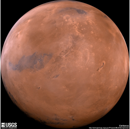
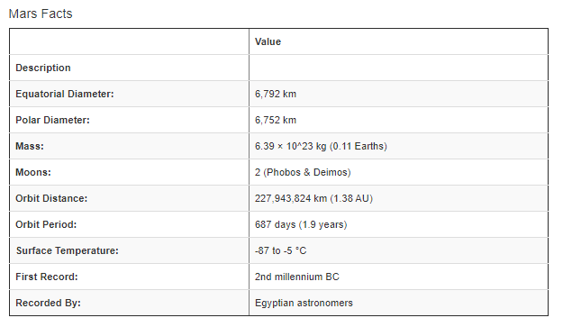

# Mission to Mars

A web-scraping app to auto-populate an html page with images and corresponding text from NASA.

* Target webpages: 
    * https://mars.nasa.gov/news/
    * https://www.jpl.nasa.gov/
    * https://space-facts.com/mars/
    * https://astrogeology.usgs.gov/

* Python used to create a website which auto-populated
    * "News Title"
    * "News Paragraph"
    * Image
    * "Facts"
    * "Hemispheres"
    
    

 

# Tools/Packages Used
* Flask
* Splinter
* BeautifulSoup
* Pandas

# How to use: 
* Ensure you have the required packages installed locally
* Clone this repository and run app.py locally
* Click the "Mars Scraper" button

The final project is a functional website which automatically scrapes and populates high resolution images and text about Mars. 

